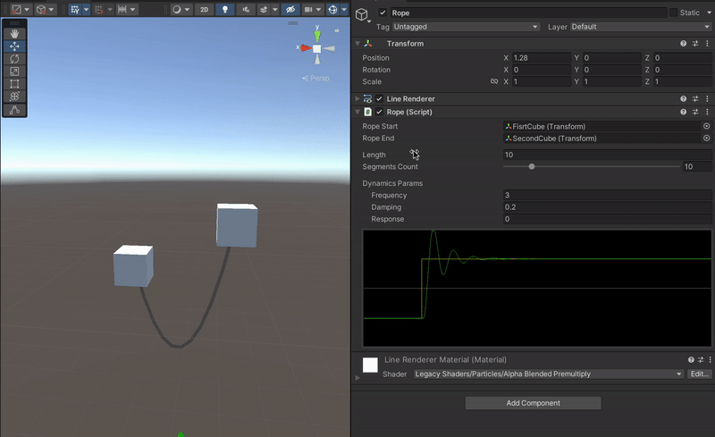
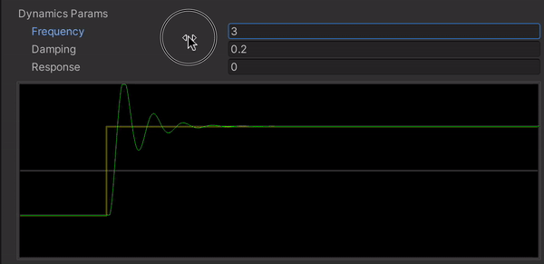
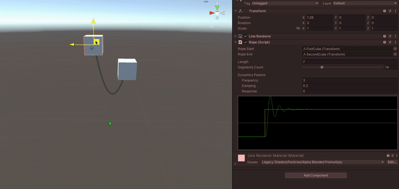
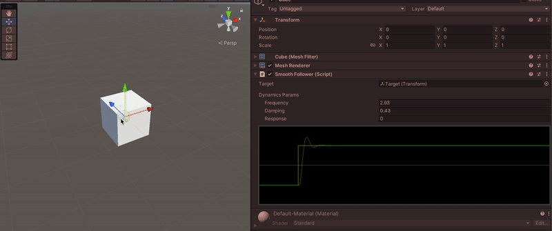

## Description

This simple rope was created for my game, but it is quite generic, so I decided to opensource it. You can use it however you like.

It is made on **Unity 2021.3.12**, but should also work well on lower or Unity higher versions.

## View

The rope visual is made with a simple [Line Renderer](https://docs.unity3d.com/Manual/class-LineRenderer.html).
To create a curve, I use a [Quadratic Bézier](https://en.wikipedia.org/wiki/B%C3%A9zier_curve), drawing an arc between the two rope attachment points and the `Middle Point`. The `Middle Point` will also be shifted down, depending on the length of the rope and the distance between the rope attachment points. You can freely set the `Length` and the number of `Segments` for the Line Renderer in the Inspector.

## Dynamic Behavior

Time to reveal the secret - the `Middle Point` is not really used to create the curve. Instead, another point is taken, which tends to take the position of the Middle one.

For this interpolation to be plausible, it must take into account not only the distance to the target, but also the speed (a derivative of distance) and acceleration (a derivative of speed). In general, we need to solve the next second-order equation:
$$y(t) + k1 * y'(t) + k2 * y''(t) = x(t) + k3 * x'(t)$$

For this, the [Euler Method](https://en.wikipedia.org/wiki/Euler_method) was used, namely its version - the [Semi-implicit Euler Method](https://en.wikipedia.org/wiki/Semi-implicit_Euler_method). The result, though physically not entirely correct, looks quite plausible.

⚠️ The main code was inspired by [👉this video👈](https://www.youtube.com/watch?v=KPoeNZZ6H4s) (or rather, even stolen from it)! Be sure to go and watch it, even if you don't want to know how it all works!

You can control three parameters:
- `Frequency` - oscillation frequency (higher value - stronger oscillation and faster reaction)
- `Damping` - attenuation of the system (less damping - longer attenuation)
- `Response` - system reaction speed (0 - smooth start, 1 - abrupt start, -1 - also an abrupt start, but in the opposite direction)

Here is how changing these parameters affects the behavior of the rope:

You can make smooth following in the same way. An example of it is also included in the repository.

## P.S.

If you like this Rope, maybe you will like [my game](https://store.steampowered.com/app/1266210/Through_the_Nightmares/) as well 😉

[)][1]

[1]: https://twitter.com/kovnirdev
